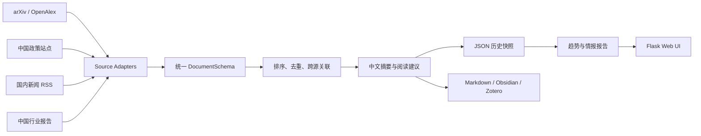

# 多源研究情报架构

## 目标与边界

系统服务于中国能源方向具身智能研究。研究对象是能源智能体对电网、储能、分布式能源、虚拟电厂和源网荷储系统的感知、决策与控制；机器人、机械臂、人形机器人不属于默认范围。非学术数据默认限定为中国政策、国内新闻和中国能源行业报告。

## 数据流

`src/pipeline/runner.py` 按 fetch、normalize、ranking、linking、summarize、export、extract、cross-source、profile、analyze、report 的顺序执行。每个 stage 接收并返回 `PipelineContext`；严重失败设置 `stop_requested`，可降级模块记录错误后保留已有结果。

## 核心模块

| 层 | 位置 | 职责 |
|---|---|---|
| 来源 | `src/sources/` | 网络请求、条件请求、游标状态、原始快照 |
| 规范化 | `src/models/document_schema.py` | 四类文档的统一字段与来源特有字段 |
| 关联 | `src/linking/` | URL/标题去重、跨来源主题关联 |
| 分析 | `src/analyzer/` | 7/30/60 日趋势、跨来源与研究画像比较 |
| 存储 | `src/storage/base.py` | 原子 `latest.json`、不可变快照、SQLite 可选后端 |
| 展示 | `src/web/`、`static/` | 同级目录、筛选、卡片、任务状态与报告 |

## 扩展约束

新增来源时继承 `BaseSourceAdapter`，实现 `validate/fetch/normalize`，在 registry 注册，并补充离线网络 mock 测试。来源必须提供稳定 `id`、`source_type`、`source_name`、`title`、`url` 和 provenance；中国来源应设置 `region: CN`。运行文件写入 `data/` 或 `logs/`，不要提交抓取缓存、密钥或本机路径。
