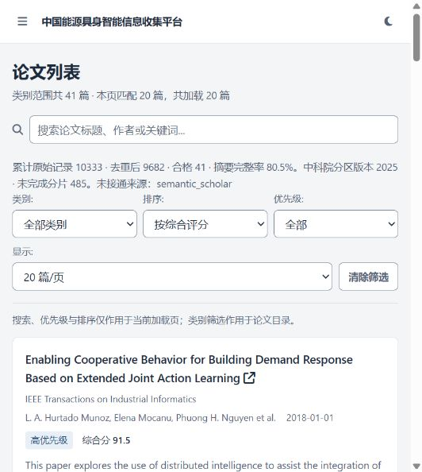

# 论文渠道扩展验收记录（2026-09-29）

## 实际结果

累计原始记录 **10,333** 条；去重候选 **9,682** 篇；通过当前中科院大类证据、原创类型和能源主题准入 **41** 篇。其中 **33** 篇有摘要，完整率 **80.49%**。

本轮从空的累积库开始写入。旧 OpenAlex 快照的 100 条/原门槛 1 条不等同于新门槛下的合格数。最初宽泛 energy 检索包含通信节能误命中，已收紧到能源系统场景，并要求由标题或摘要提供主题证据；聚合平台的宽泛主题标签不能单独满足准入。以上为收紧后的统计。

| 来源 | 原始记录 | 独有去重候选 | 合格论文贡献 | 独有合格论文 |
|---|---:|---:|---:|---:|
| crossref | 3819 | 3774 | 4 | 3 |
| openaire | 2252 | 1993 | 18 | 16 |
| openalex_search | 4262 | 3801 | 21 | 20 |
| semantic_scholar | 0 | 0 | 0 | 0 |

来源合格贡献可以重叠；机构导入通过四种格式的离线验收，尚未导入用户实际机构检索结果，不计为已完成覆盖。Semantic Scholar 缺少密钥，本轮贡献为零。

## 日期、主题与覆盖

检索范围：2016-09-29 至 2026-09-29；先试采 2025 年 9 月，再进行十年范围的有限预算采集和定向期刊分页。首轮 12 次、十年范围 90 次、定向期刊试采 12 次分页请求；引文队列另执行 24 次请求。

| 年份 | 合格论文 |
|---|---:|
| 2017 | 2 |
| 2018 | 3 |
| 2020 | 2 |
| 2021 | 3 |
| 2022 | 4 |
| 2023 | 7 |
| 2024 | 1 |
| 2025 | 17 |
| 2026 | 2 |

主题标签（可重叠）：

- 02 engineering and technology：17
- 0202 electrical engineering, electronic engineering, information engineering：16
- Smart Grid Energy Management：12
- Microgrid Control and Optimization：11
- 7. Clean energy：10
- 0211 other engineering and technologies：6
- Electric Vehicles and Infrastructure：5
- 11. Sustainability：4
- Advanced Battery Technologies Research：4
- Smart Grid and Power Systems：4
- Electric and Hybrid Vehicle Technologies：3
- Energy Load and Power Forecasting：3
- Power Systems and Renewable Energy：3
- Frequency Control in Power Systems：2
- Smart Grid Security and Resilience：2

分片状态：{"partial": 94, "unavailable": 121, "pending": 270}。尚未完成分片 485 个（含缺密钥和引文队列）。

已记录的查询分页状态：{"incomplete": 1920, "complete": 2}。**近十年只是已建立补采范围，尚未穷尽全部分页，不能宣称全量覆盖。** 同一补采命令可续跑；新检索式或分区期刊名单会重新核对覆盖。

引文追溯为两层参考文献、一层施引，自动测试验证深度边界；本轮队列仍未完成，未获得的早期经典论文不计作覆盖。

## 准入拒收与证据缺口

| 原因 | 去重候选数 |
|---|---:|
| outside_research_scope | 8398 |
| not_original_research | 112 |
| cas_partition_unverified | 852 |
| not_a_formal_journal_article | 205 |
| missing_journal_venue | 74 |

另外 536 条原始记录被结构校验或原有研究边界过滤，仍保留原始缓存。

用户提供的 2025 年计算机科学 Top 期刊 PDF 共 64 本：53 本一区、11 本二区；64 本在 Excel 备份中均可找到，分区全部一致。注册表记录了 ISSN、学科、年份、核验时间、PDF SHA-256 和页码。原始 PDF、Excel 与注册表均只保存在本地。

该 PDF 只证明计算机科学名单，不能确认整个 Excel 的分区口径。原有 13 本期刊复核如下：

| 期刊 | ISSN | 2025 大类证据 |
|---|---|---|
| IEEE Transactions on Smart Grid | 1949-3053 | 待核验：本 PDF 未覆盖 |
| IEEE Transactions on Power Systems | 0885-8950 | 待核验：本 PDF 未覆盖 |
| IEEE Transactions on Sustainable Energy | 1949-3029 | 待核验：本 PDF 未覆盖 |
| IEEE Transactions on Industrial Informatics | 1551-3203 | 已核验：计算机科学 1 区，PDF 第 2 页 |
| IEEE Internet of Things Journal | 2327-4662 | 已核验：计算机科学 2 区，PDF 第 5 页 |
| Applied Energy | 0306-2619 | 待核验：本 PDF 未覆盖 |
| Energy | 0360-5442 | 待核验：本 PDF 未覆盖 |
| Energy Conversion and Management | 0196-8904 | 待核验：本 PDF 未覆盖 |
| Renewable and Sustainable Energy Reviews | 1364-0321 | 待核验：本 PDF 未覆盖 |
| Renewable Energy | 0960-1481 | 待核验：本 PDF 未覆盖 |
| International Journal of Electrical Power and Energy Systems | 0142-0615 | 待核验：本 PDF 未覆盖 |
| Nature Energy | 2058-7546 | 待核验：本 PDF 未覆盖 |
| Joule | 2542-4351 | 待核验：本 PDF 未覆盖 |

待补证期刊候选量（前 15）：

- Energies：39
- Applied Energy：38
- IEEE Transactions on Smart Grid：30
- IEEE Access：30
- IEEE Transactions on Transportation Electrification：16
- CoRR：16
- RE&amp;PQJ：16
- Energy：16
- Frontiers in Energy Research：13
- CSEE Journal of Power and Energy Systems：11
- SSRN Electronic Journal：11
- Journal of Modern Power Systems and Clean Energy：10
- Electronics：9
- Applied Sciences：9
- International Journal of Power Electronics and Drive Systems/International Journal of Electrical and Computer Engineering：8

IEEE Communications Surveys & Tutorials 的官方范围是综述和教程；已单独排除，避免上游 article 标签误放行。[IEEE 期刊范围](https://www.comsoc.org/publications/journals/ieee-communications-surveys-tutorials)。

## 验证与运行边界

- `python -m unittest discover -s test -p "test_*.py"`：199 项通过。
- `node --test test/web_workspace.test.cjs`：17 项通过。
- `python -m pip check`、`python -m compileall -q src`、`git diff --check`：通过。
- Flask `/api/papers` 三页返回 200，页内数量分别为 20、20、1；`/api/papers/quality` 返回 200。
- 浏览器验证累积数量、分页、分区版本、缺摘要标记与不可用渠道。
- 当前环境没有 pyright 命令，未将静态类型检查计为已通过。
- 采集库先于 LLM 持久化；本轮未调用 LLM 生成论文内容总结。页面展示已有原始摘要。
- 默认每周日 09:00 更新与续采配置已写入；本次未启动常驻调度服务。

详细操作见 [论文获取与质量管理](paper_acquisition.md)。实时统计在本地 `data/library/quality_report.json` 与 `quality_report.md`，此文档为本次验收快照。

