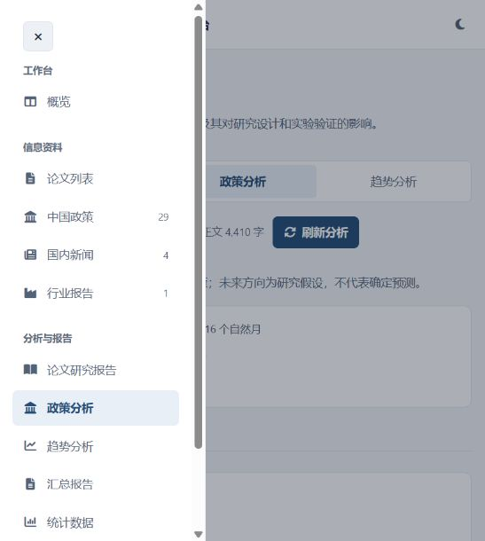
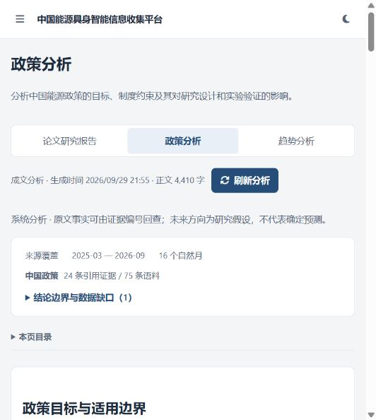
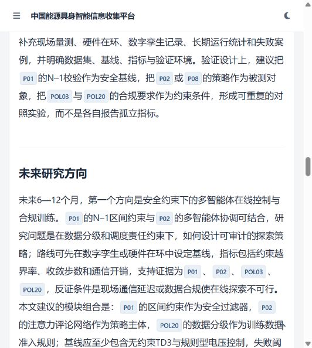

# 三类研究报告恢复验收

## 本次结果

2026-09-29 完成一次来源采集、规范化、准入、摘要、知识抽取、分析、证据链接核验与报告保存。Crossref 的空日期组件导致首次处理中断；修复解析后从已持久化来源快照续跑，未重复下载整批资料。

当前批次 110 条资料：76 篇论文、29 条政策、4 条新闻、1 条行业报告。历史分析语料另按主题、文献准入和日期核验，不等同于当前批次数。

| 独立入口 | 正文可见字符数 | 章节 | 入选证据 |
| --- | ---: | ---: | ---: |
| 论文研究报告 `#paper-report` | 4,492 | 5 | 36 |
| 政策分析 `#policy-analysis` | 4,410 | 5 | 24 |
| 趋势分析 `#analysis` | 4,694 | 7 | 58 |

三份正文均已生成并在本次任务中进行证据边界审校，保存模式为 `llm_controlled_reviewed`。周报与阶段报告各含 23 个正文或附录部分，接口中的三种 `narrative_generation` 状态均为 `generated`。自动校验负责章节、长度、引用编号与范围，不代表对文章所有事实的自动核实。

## 修复内容

- 恢复侧栏三个独立入口及对应路由，保留共享阅读器和证据回查；汇总报告独立保留。
- 每次完整运行同时保存周报、阶段报告。缺少当前分析时提供明确标识的证据预览，避免静默显示旧空结构；页面刷新读取已保存正文。
- 写作输入由短系统摘要改为原始证据文本。长度修订区分压缩与补充，规范未加括号的引用标签，并继续拒绝未知引用。
- 两份历史行业报告仅取得题录或附件发布信息，旧系统摘要曾带入没有原文支持的统计数字。本轮趋势正文已删除这些数字；提示词不再接收生成摘要作为证据，简短行业发布页也不会调用模型编写内容总结。
- 审校时把“摘要未说明某实验”与“论文没有做该实验”分开，明确新方案、基线和实验阈值属于研究建议；行政调查期限不被直接用作控制采样周期或训练惩罚延迟。
- 历史论文分析同时执行分区与主题准入；Crossref 缺失或无效日期保留可核验的年月精度。

## 数据覆盖边界

累计采集缓存 17,191 条，跨源去重后 16,089 条，合格论文 76 篇，较上一批 41 篇增加 35 篇；其中 53 篇有摘要，完整率 69.74%。分区依据仍为已核验的 2025 年中科院大类证据。Semantic Scholar 缺少密钥；489 个检索分片尚未完成，不代表十年回溯已经采集完毕。行业报告全文与新闻历史覆盖仍不足，正文中保留具体缺口。

## 验证

- `python -m unittest discover -s test -p "test_*.py"`：207 项通过。
- `node --test test/web_workspace.test.cjs`：18 项通过。
- `node --check static/js/main.js` 与 `git diff --check` 通过。
- 三个 `/api/trends/narrative` 视图及两种 `/api/reports/latest` 报告均返回 HTTP 200 和非空正文。
- 浏览器验证三个独立导航入口、成文状态、连续段落与引用按钮。

原始资料、生成报告、运行日志和本机路径仅保存在本地数据目录，不随代码提交。
